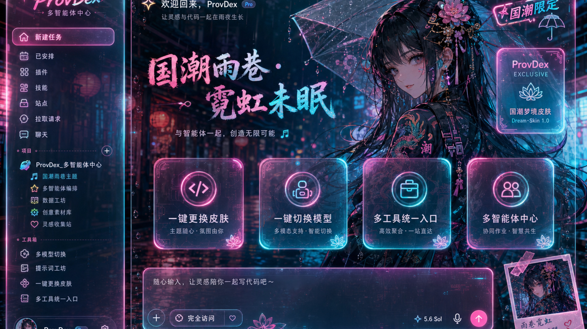
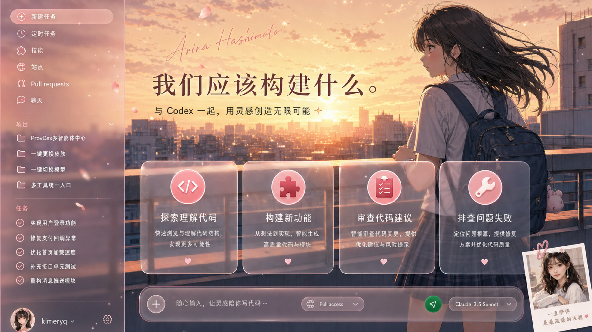
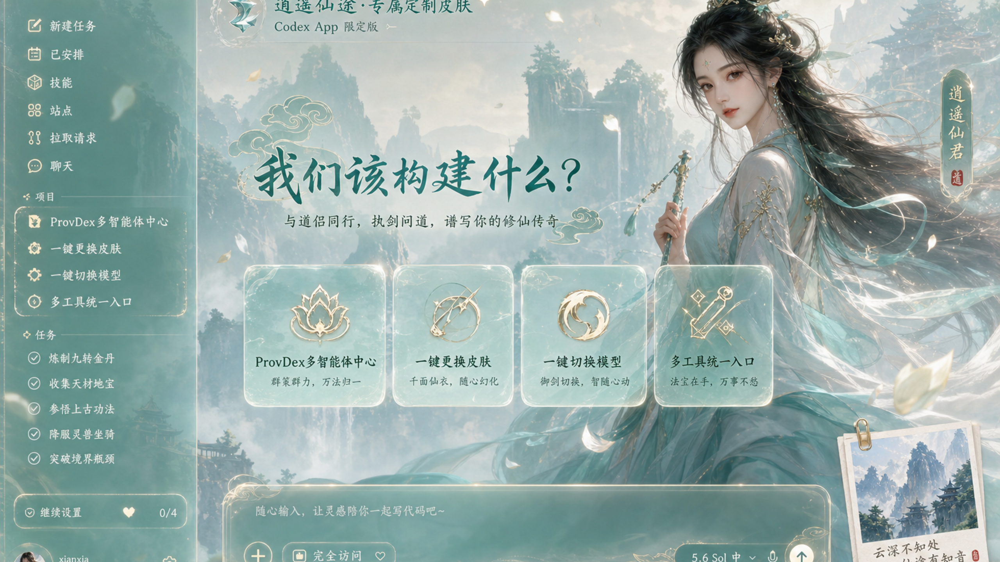
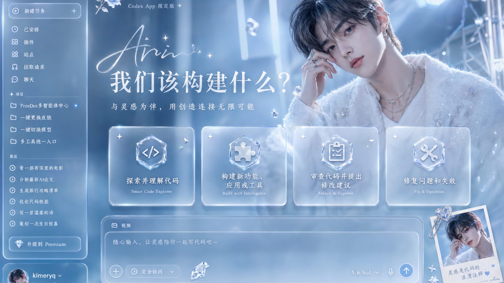
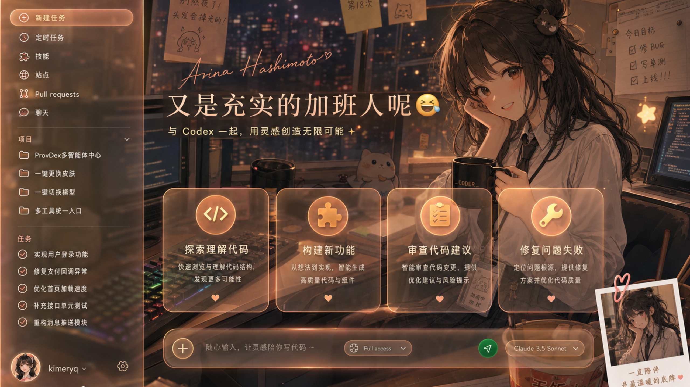
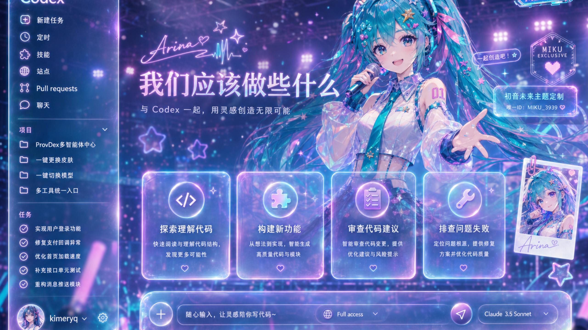
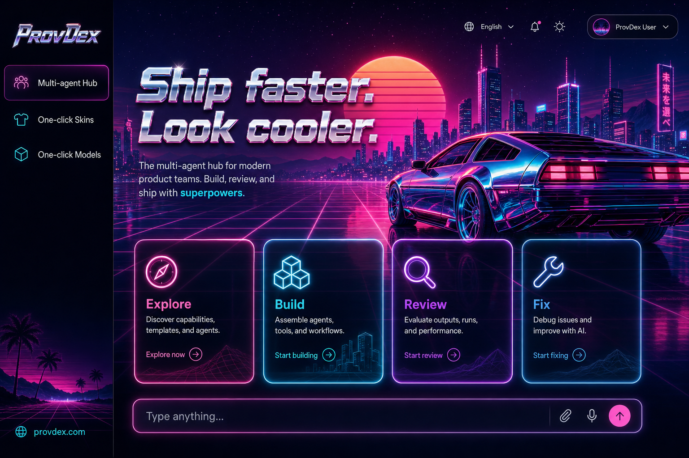

<p align="center">
  
</p>

<h1 align="center">agent-skin-hub</h1>

<p align="center">
  <strong>给 Codex 换一套好看的皮肤。</strong><br/>
  免费 · 开源 · 用 ProvDex 打开就能装
</p>

<p align="center">
  <a href="https://github.com/Chiody/agent-skin-hub/stargazers"></a>
  <a href="./LICENSE"></a>
  <a href="https://provdex.com/skinhub.html"></a>
  <a href="./gallery.json"></a>
</p>

<p align="center">
  <a href="https://provdex.com">ProvDex</a> ·
  <a href="https://provdex.com/skinhub.html">Skin Hub</a> ·
  <a href="./CODEX-PROMPT.md">发给 Codex</a> ·
  <a href="./catalog.json">catalog.json</a> ·
  <a href="./gallery.json">gallery.json</a>
</p>

---

## 像 Fei-Away 那样丢给 Codex

可以把本仓链接直接发给 **macOS Codex**，让它自己换肤（不必装 ProvDex）：

1. 把链接发给 Codex：`https://github.com/Chiody/agent-skin-hub`
2. 再贴上 [`CODEX-PROMPT.md`](./CODEX-PROMPT.md) 里的整段提示词（或下面最短版）
3. Codex 会读 [`SKILL.md`](./SKILL.md) / [`AGENTS.md`](./AGENTS.md)，执行 `apply-hub-skin.sh`

最短指令：

```text
用 https://github.com/Chiody/agent-skin-hub 在这台 Mac 给 Codex 换肤。
读 SKILL.md，执行：
curl -fsSL https://cdn.jsdelivr.net/gh/Chiody/agent-skin-hub@main/scripts/apply-hub-skin.sh | bash -s -- preset-trial-yuexin-miao
只改外观，别动官方 .app 和 API 配置。验收侧栏/建议卡/输入框是否清晰。
```

一键命令（终端也可直接跑）：

```bash
# 列出皮肤
curl -fsSL https://cdn.jsdelivr.net/gh/Chiody/agent-skin-hub@main/scripts/apply-hub-skin.sh | bash -s -- --list

# 安装并应用（示例：月薪喵）
curl -fsSL https://cdn.jsdelivr.net/gh/Chiody/agent-skin-hub@main/scripts/apply-hub-skin.sh | bash -s -- preset-trial-yuexin-miao
```

---

写代码已经够累了，工作台至少可以好看一点。

下面这些是**概念效果图**（整窗画了 Codex 界面：玻璃侧栏、建议卡、底部输入框）。真机换肤用的是旁边的**纯背景**，别把广告图当壁纸导入。

侧栏「项目」里那几行，就是 ProvDex 在说的事：多智能体中心、一键换肤、一键切模型。

| 资源 | 干什么用 | 在哪 |
|------|----------|------|
| 概念效果图 | GitHub / 官网画廊 | [`docs/ads/`](./docs/ads/) |
| 纯背景底图 | 真机导入 | [`presets/*/background.jpg`](./presets/) |
| 真机实拍 | 原生控件换色后的样子 | [`docs/previews/`](./docs/previews/) |
| 索引 | 按需拉 URL | [`gallery.json`](./gallery.json) · [`catalog.json`](./catalog.json) |

---

## 概念画廊 · 玻璃风 v2

<table>
  <tr>
    <td width="50%"><br/><sub>01 · 夜樱玻璃</sub></td>
    <td width="50%"><br/><sub>02 · 财神打工</sub></td>
  </tr>
  <tr>
    <td><br/><sub>03 · 国潮赛博</sub></td>
    <td><br/><sub>04 · 放学屋顶</sub></td>
  </tr>
  <tr>
    <td><br/><sub>05 · 修仙国漫</sub></td>
    <td><br/><sub>06 · 韩偶女</sub></td>
  </tr>
  <tr>
    <td><br/><sub>07 · 韩偶男</sub></td>
    <td><br/><sub>08 · 加班梗图</sub></td>
  </tr>
  <tr>
    <td><br/><sub>09 · 汉服园林</sub></td>
    <td><br/><sub>10 · 虚拟偶像</sub></td>
  </tr>
  <tr>
    <td colspan="2" align="center"><br/><sub>11 · 锦鲤好运</sub></td>
  </tr>
</table>

说明 → [`docs/ads/README.md`](./docs/ads/README.md)

---

## 概念画廊 · 海外 / 其他（保留）

原先国外向那批全部保留，编号接在后面：

<table>
  <tr>
    <td width="50%"><br/><sub>12 · Synthwave 80s</sub></td>
    <td width="50%"><br/><sub>13 · 北欧极简</sub></td>
  </tr>
  <tr>
    <td><br/><sub>14 · 赛博雨夜</sub></td>
    <td><br/><sub>15 · 海边编程</sub></td>
  </tr>
  <tr>
    <td><br/><sub>16 · 咖啡窝</sub></td>
    <td><br/><sub>17 · 黑客终端</sub></td>
  </tr>
  <tr>
    <td><br/><sub>18 · 樱花夜</sub></td>
    <td><br/><sub>19 · 蒸汽朋克</sub></td>
  </tr>
  <tr>
    <td><br/><sub>20 · 沙漠落日</sub></td>
    <td><br/><sub>21 · 雪屋静写</sub></td>
  </tr>
  <tr>
    <td><br/><sub>22 · 太空站</sub></td>
    <td><br/><sub>23 · Teal SaaS</sub></td>
  </tr>
</table>

> 只替换了对标 [Fei-Away/Codex-Dream-Skin](https://github.com/Fei-Away/Codex-Dream-Skin) 画廊那几张；海外向原图未删。对照仓旧克隆仍在 [`docs/ads/archive-old-20/`](./docs/ads/archive-old-20/)。

---

## 已配对：概念 × 底图 × 真机

| 概念 | 可导入底图 | 真机实拍 |
|------|------------|----------|
| 夜樱玻璃 | [`preset-trial-rose-soft`](./presets/preset-trial-rose-soft) | [preview](./docs/previews/preset-trial-rose-soft.jpg) |
| 财神打工 | [`preset-trial-caishen`](./presets/preset-trial-caishen) | [preview](./docs/previews/preset-trial-caishen.jpg) |
| 国潮赛博 | [`preset-trial-neon-rain`](./presets/preset-trial-neon-rain) | [preview](./docs/previews/preset-trial-neon-rain.jpg) |

---

## 怎么用

1. **发给 Codex**（推荐）：仓库链接 + [`CODEX-PROMPT.md`](./CODEX-PROMPT.md)  
2. 打开 [ProvDex](https://provdex.com) → Codex → **外观**  
3. 或逛 [Skin Hub](https://provdex.com/skinhub.html) 复制安装命令  

```bash
curl -fsSL https://cdn.jsdelivr.net/gh/Chiody/agent-skin-hub@main/catalog.json | head
curl -fsSL https://cdn.jsdelivr.net/gh/Chiody/agent-skin-hub@main/scripts/apply-hub-skin.sh | bash -s -- --list
```

---

## 可安装皮肤

完整目录见 [`catalog.json`](./catalog.json)（含 `wallpaperUrl` / `previewUrl`），预设在 [`presets/`](./presets/)。

---

## 想投稿？

```text
presets/preset-your-slug/
  theme.json
  background.jpg   ← 纯背景 16:9，别拿整页 UI 截图凑数
  SOURCE.md
```

**别投：** 游戏角色、真人明星脸、带侧栏输入框的假截图。

```bash
node scripts/build-catalog.mjs
node scripts/build-gallery.mjs
```

---

## License

MIT。每套皮肤看各自的 `SOURCE.md`。
